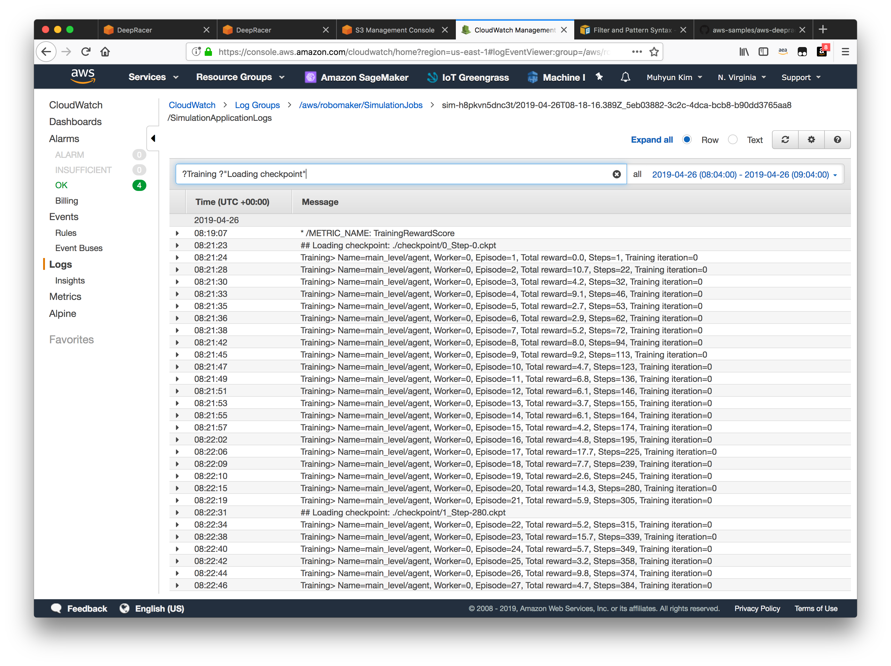
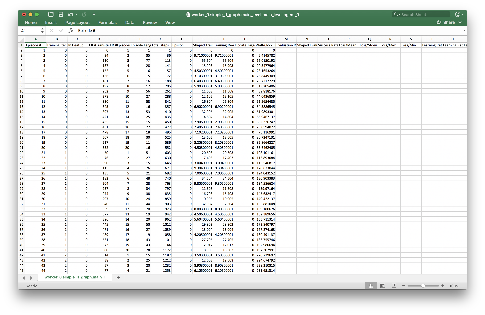
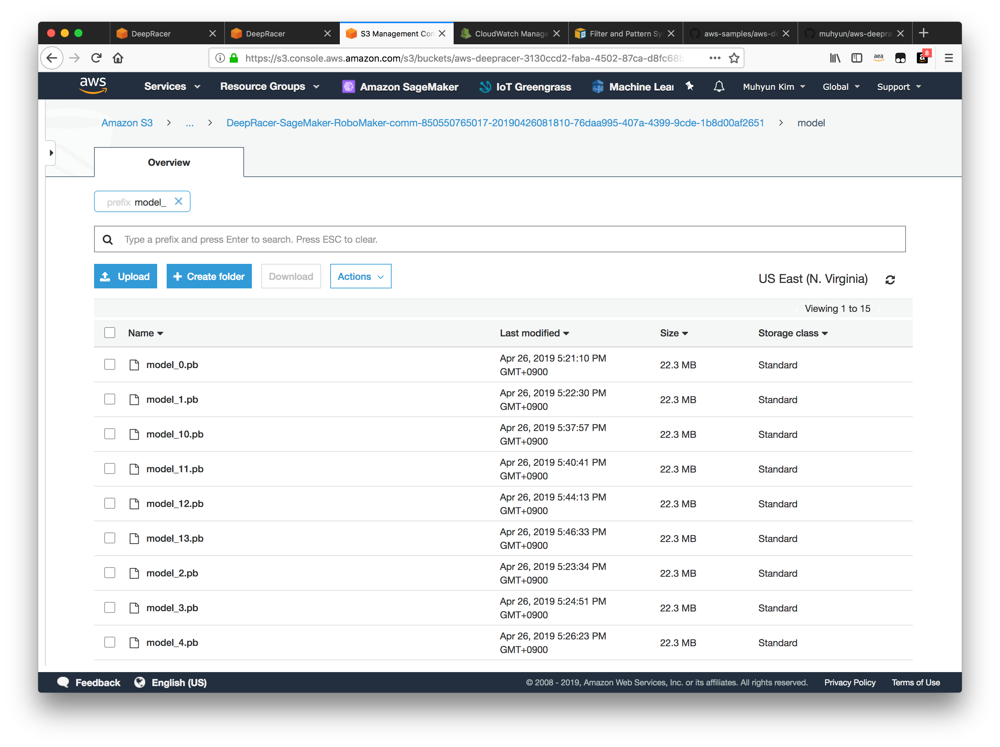

## How to find the checkpoint working well from CloudWatch Log

### Step 0 : Find the right CloudWatch Log streams you want to dig into

Currently there is no straightforward way to map deepracer job id with cloudwatch log stream name. Use the time stamp in the stream name and the training start time.

### Step 1-A : Filter out the logs to find 

Using a filter string below,

> ?Training ?"Loading checkpoint"

1. find the episodes with high and stable total reward scores
2. then, find the checkpoint number in the line having "## Loading checkpoint" before or after those episode.

### Step 1-B: Using csv file in model.tar.gz 

You can do the same by taking a look at csv file found in the downloaded model file from DeepRacer console. The second column indicates the checkpoint number.

### Step 2 - Download the checkpoint file from S3

Go to Amazon S3 console, and clink on a bucket whose name starts with "aws-deepracer-", and then click on a folder which has the same timestamp as CloudWatch Log stream above. You will see two folders; ip and models. Go to "models" folder, and filter out using "model_" prefix. You will get a screen as below.

The number in the file name is the check point number you find in Step 1. Download one that you want to your local PC.

### Step 3. Replacing model.pd file

1. Download "model" from DeepRacer console by clicking "Download model"
2. Untar "model.tar.gz" and replace "model.pb" file with the one from Step 2. 
3. Tar and gzip 4 files to have model.tar.gz which you want to use for Racing.